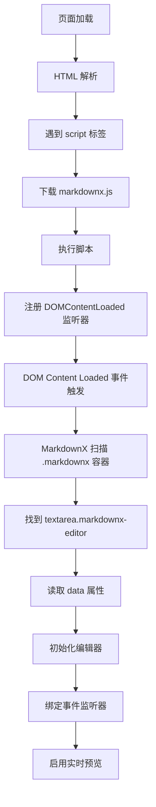

# MarkdownX 工作原理说明

## ⚠️ 重要概念

### django-markdownx 4.x 使用 Browserify 打包

django-markdownx 的 JavaScript 文件使用了 **Browserify/Webpack** 模块打包系统，这意味着：

1. ❌ **不会**在全局作用域中暴露 `MarkdownX` 对象
2. ✅ **会**通过 data 属性自动初始化编辑器
3. ✅ **会**在 DOM Ready 时自动扫描并初始化所有 `.markdownx` 容器

### 正确的初始化方式

```html
<!-- ✅ 正确：使用 data 属性 -->
<div class="markdownx">
    <textarea 
        class="markdownx-editor"
        data-markdownx-editor-resizable="true"
        data-markdownx-urls-path="/markdownx/upload/"
        data-markdownx-latency="500">
    </textarea>
    <div class="markdownx-preview"></div>
</div>

<script src=""></script>
<!-- MarkdownX 会自动初始化，无需手动调用 new MarkdownX() -->
```

```javascript
// ❌ 错误：尝试访问全局 MarkdownX 对象
if (typeof MarkdownX !== 'undefined') {
    // 这永远不会为 true！
}

// ❌ 错误：尝试手动初始化
new MarkdownX(container, textarea);  // MarkdownX is not defined
```

## 🔍 为什么之前的代码报错

### 错误的检查方式

```javascript
// 这段代码总是会失败
if (typeof MarkdownX === 'undefined') {
    console.error('❌ MarkdownX is NOT loaded!');
}
```

**原因**: django-markdownx 4.x 的打包格式不暴露全局对象。

### 正确的检查方式

```javascript
// 检查编辑器元素是否存在
const editor = document.querySelector('.markdownx-editor');
const preview = document.querySelector('.markdownx-preview');
const container = document.querySelector('.markdownx');

if (editor && preview && container) {
    console.log('✅ MarkdownX elements found');
    console.log('✅ Auto-initialization should work');
}
```

## 📊 MarkdownX 初始化流程



## ✅ 已修复的代码

### studio.html 和 post_edit.html

```javascript
document.addEventListener('DOMContentLoaded', function() {
    // 检查编辑器元素
    const editor = document.querySelector('.markdownx-editor');
    const preview = document.querySelector('.markdownx-preview');
    const container = document.querySelector('.markdownx');
    
    if (editor) {
        console.log('✅ Editor found');
        console.log('✅ MarkdownX will auto-initialize via data attributes');
    }
    
    // 不需要手动初始化！
    // MarkdownX 会自动处理
});
```

## 🎯 Data 属性说明

| 属性 | 作用 | 示例值 |
|------|------|--------|
| `data-markdownx-editor-resizable` | 是否可调整大小 | `"true"` / `"false"` |
| `data-markdownx-urls-path` | Markdown 转换 API 路径 | `"/markdownx/markdownify/"` |
| `data-markdownx-upload-urls-path` | 图片上传 API 路径 | `"/markdownx/upload/"` |
| `data-markdownx-latency` | 防抖延迟（毫秒） | `"500"` |

## 🔧 自定义配置

如果需要自定义行为，可以修改 data 属性：

```html
<textarea
    class="markdownx-editor"
    data-markdownx-editor-resizable="true"
    data-markdownx-urls-path="/markdownx/markdownify/"
    data-markdownx-upload-urls-path="/markdownx/upload/"
    data-markdownx-latency="300">
</textarea>
```

或者在 `settings.py` 中配置默认值：

```python
MARKDOWNX_DEFAULT_ATTRIBUTES = {
    'class': 'markdownx-editor',
    'placeholder': 'Start writing...',
    'data-markdownx-editor-resizable': 'true',
    'data-markdownx-latency': '500',
}
```

## 🐛 常见问题

### Q1: 编辑器没有初始化怎么办？

**检查清单**:
1. ✅ 是否有 `.markdownx` 容器
2. ✅ 是否有 `textarea.markdownx-editor`
3. ✅ 是否有 `.markdownx-preview` div
4. ✅ 是否正确加载了 `markdownx.js`
5. ✅ data 属性是否正确设置

**调试步骤**:
```javascript
// 在控制台中运行
console.log('Container:', document.querySelector('.markdownx'));
console.log('Editor:', document.querySelector('.markdownx-editor'));
console.log('Preview:', document.querySelector('.markdownx-preview'));
```

### Q2: 实时预览不工作？

**可能原因**:
1. `/markdownx/markdownify/` API 不可访问
2. CSRF token 缺失
3. JavaScript 错误

**解决方案**:
```javascript
// 测试 API
fetch('/markdownx/markdownify/', {
    method: 'POST',
    headers: {
        'Content-Type': 'application/x-www-form-urlencoded',
        'X-CSRFToken': getCSRFToken()
    },
    body: 'content=# Test'
})
.then(r => r.json())
.then(data => console.log('API response:', data));
```

### Q3: 图片上传失败？

**可能原因**:
1. MEDIA_ROOT 未配置
2. media 目录不存在
3. 权限问题

**解决方案**: 参考 `MARKDOWNX_UPLOAD_FIX.md`

## 📝 总结

### ✅ 正确做法

1. 使用 data 属性配置编辑器
2. 让 MarkdownX 自动初始化
3. 检查 DOM 元素是否存在
4. 不要尝试访问全局 `MarkdownX` 对象

### ❌ 错误做法

1. 检查 `typeof MarkdownX`
2. 手动调用 `new MarkdownX()`
3. 尝试从全局作用域访问 MarkdownX

### 🎓 关键要点

- django-markdownx 4.x 使用模块打包，不暴露全局对象
- 通过 data 属性自动初始化
- 只需确保 HTML 结构正确，其余交给 MarkdownX

## 🔗 相关资源

- [django-markdownx 文档](https://django-markdownx.readthedocs.io/)
- [Browserify 文档](http://browserify.org/)
- [MDN: Data Attributes](https://developer.mozilla.org/en-US/docs/Web/HTML/Global_attributes/data-*)
